<div align="center">

# Neuro

**The Zero-Trust, Memory-Safe Compiler Pipeline**

[](https://www.rust-lang.org/)
[](https://dotnet.microsoft.com/en-us/languages/csharp)
[](https://isocpp.org/)
[](LICENSE)
`[Status: Live]`

</div>

---

## Install

Download and install the pre-compiled standalone binaries (Linux x64):

```bash
curl -sSL https://raw.githubusercontent.com/pd241008/Neuro/main/install.sh | bash
```
*Note: Make sure to add `~/.neuro/bin` to your `PATH` after installation.*

---

## Usage

```bash
# Most common command — compile a Neuro source file
neuro compile source.nro

# Launch the interactive REPL
neuro gui
```

### Options

```text
neuro --help

Usage: neuro <COMMAND>

Commands:
  compile  Compiles a source file through the full pipeline
  audit    Runs only the security audit phase on a pre-compiled AST
  gui      Launches the interactive Neuro REPL
  help     Print this message or the help of the given subcommand(s)

Options:
  -h, --help  Print help
```

---

## What It Does

**NEURO** is a blazing-fast, polyglot Compiler Pipeline designed with a **"security-first"** philosophy. 

> **Accomplished 100% memory safety and logical validation before code generation, as measured by a zero-trust semantic analysis phase, by orchestrating strict borrow-checking and scope validation rules entirely within the Rust Middle-End.**

The pipeline is split across three isolated micro-architectures: a **C# Frontend** (Lexing & Parsing), a **Rust Middle-End** (Zero-Trust Security Audit), and a **C++ Backend** (LLVM IR Lowering). The orchestrator coordinates these tools mathematically guaranteeing logic and memory safety, while eliminating general-purpose vulnerabilities by strictly defining expression boundaries.

### Why NEURO?

*   **⚡ World-Class DX**: Visually stunning terminal interfaces and precise, tutor-like error reporting using `miette`.
*   **🛡️ Zero-Trust Middle-End**: Mathematically guarantees logic and memory safety before a single line of target code is generated.
*   **🔒 Domain-Specific Constraints**: Eliminates general-purpose vulnerabilities by strictly defining expression boundaries.

---

## Architecture

```mermaid
graph LR
    A[Source Code] --> B(neuro_cli - Rust)
    B --> C(frontend - C#)
    subgraph frontend [The Lexer & Parser]
        C --> C1[Lexing]
        C1 --> C2[Parsing]
        C2 --> C3[Raw AST]
    end
    C3 --> D(analyzer - Rust)
    subgraph analyzer [The Auditor]
        D --> D1[Security Audit]
        D1 --> D2[Verified AST]
    end
    D2 --> E(backend - C++)
    subgraph backend [The Translator]
        E --> E1[Lowering]
        E1 --> E2[LLVM IR]
    end
    E2 --> F[Executable]
    F -.-> G(runtime - C)
    
    style frontend fill:#1e1e1e,stroke:#239120,stroke-width:2px
    style analyzer fill:#1e1e1e,stroke:#f74c00,stroke-width:2px
    style backend fill:#1e1e1e,stroke:#00599c,stroke-width:2px
```



### Modules

1.  **`neuro_cli` (The Orchestrator) [Rust]**: Handles file I/O, progress visuals, multi-threading, and triggers the compilation phases.
2.  **`frontend` (The Lexer & Parser) [C#]**: Responsible for lexical analysis, hand-written recursive descent parsing, and initial error reporting. Generates the initial Protobuf AST.
3.  **`analyzer` (The Security Auditor) [Rust]**: Performs the Zero-Trust Security Audit, memory-safety checks, and AST validation.
4.  **`backend` (The Translator) [C++]**: Ingests the proven AST and lowers it into highly optimized target code (LLVM IR).
5.  **`runtime` (The Foundation) [C]**: Provides low-level memory management and I/O primitives for the generated executables.

---

## 🗺️ Development Roadmap

### Phase 1: Architecture & Scaffolding `[COMPLETED ✅]`
- [x] Scaffold Rust Workspace.
- [x] Wire crate dependencies.
- [x] Cyberpunk-style terminal visuals (`clap`, `indicatif`).

### Phase 2: Domain-Specific Language (DSL) `[COMPLETED ✅]`
- [x] **Syntax Design**: Mapping keywords (`fn`, `let`, `mut`, `type`).
- [x] **Grammar Specification**: Formal EBNF rules.
- [x] **Security Rules**: Defining rejection criteria for unsafe patterns.

### Phase 3: The Front-End (`frontend`) `[COMPLETED ✅]`
- [x] **The Lexer**: High-performance C# memory-scanner with offset tracking.
- [x] **The Parser**: Hand-written recursive descent parser outputting Protobuf AST.
- [x] **DX Integration**: Structure errors for `miette` reporting in Rust.

### Phase 4: Zero-Trust Middle-End `[COMPLETED ✅]`
- [x] Scope stack management and Variable lookup implementation.
- [x] Generate Rust types from `shared_ast/ast.proto` (prost).
- [x] Recursive AST traversal and type resolution mapping.
- [x] Variable move semantics (read/write after move detected) via Borrow Checker.
- [x] Structured `NeuroError` diagnostics with `miette`.

### Phase 5: The Back-End (`backend`) `[COMPLETED ✅]`
- [x] Extend `ast.proto` with resolved type annotations.
- [x] Parse enriched Protobuf AST in `backend/main.cpp`.
- [x] Lower Functions, Variables, Binary arithmetic, Comparisons to LLVM IR.
- [x] Lower Control Flow (`IfStmt`, `WhileStmt`) and I/O (`Printf`, `Scanf`).
- [x] Build runtime library and compile `.ll` → `.o` → executable.

### Phase 6: Release Automation `[COMPLETED ✅]`
- [x] Isolate dependencies into standalone executables.
- [x] Continuous Integration release pipeline via GitHub Actions.
- [x] One-line global installer script for fast user onboarding.

---

## 🤝 Contributing

Contributions are welcome! Please feel free to submit a Pull Request. For major changes, please open an issue first to discuss what you would like to change.

1. Fork the Project
2. Create your Feature Branch (`git checkout -b feature/AmazingFeature`)
3. Commit your Changes (`git commit -m 'Add some AmazingFeature'`)
4. Push to the Branch (`git push origin feature/AmazingFeature`)
5. Open a Pull Request

---

## 📜 License

Distributed under the MIT License. See `LICENSE` for more information.

<p align="center">
  Built with 🦀 and ☕ by the Prathmesh Desai
</p>

_[pd241008](https://github.com/pd241008) · [ct-os-dev-portfolio.vercel.app](https://ct-os-dev-portfolio.vercel.app)_
