<h1 align="center">🧠 NEURO</h1>

<p align="center">
  <strong>The Zero-Trust, Memory-Safe Compiler Pipeline</strong>
</p>

<p align="center">
  <a href="https://www.rust-lang.org/"></a>
  <a href="https://dotnet.microsoft.com/en-us/languages/csharp"></a>
  <a href="https://isocpp.org/"></a>
  <a href="https://en.wikipedia.org/wiki/C_(programming_language)"></a>
  <a href="LICENSE"></a>
</p>

---

## 🚀 Overview

**NEURO** is a blazing-fast, memory-safe, polyglot Compiler Pipeline built with **Rust**, **C#**, **C++**, and **C**. Designed with a **"security-first"** philosophy, NEURO acts as a strict validator for execution-critical software, ensuring memory safety and logical consistency at the language level.

### Why NEURO?

*   **⚡ World-Class DX**: Visually stunning terminal interfaces and precise, tutor-like error reporting using `miette`.
*   **🛡️ Zero-Trust Middle-End**: Mathematically guarantees logic and memory safety before a single line of target code is generated.
*   **🔒 Domain-Specific Constraints**: Eliminates general-purpose vulnerabilities by strictly defining expression boundaries.

---

## 🏗️ System Architecture

The pipeline is divided into three isolated micro-architectures compiled into a single workspace.



```mermaid
graph LR
    A[Source Code] --> B(neuro_cli - Rust)
    B --> C(frontend - C#)
    subgraph frontend [The Lexer & Parser]
        C --> C1[Lexing]
        C1 --> C2[Parsing]
        C2 --> C3[Raw AST]
    end
    C3 --> D(analyzer - Rust)
    subgraph analyzer [The Auditor]
        D --> D1[Security Audit]
        D1 --> D2[Verified AST]
    end
    D2 --> E(backend - C++)
    subgraph backend [The Translator]
        E --> E1[Lowering]
        E1 --> E2[LLVM IR]
    end
    E2 --> F[Executable]
    F -.-> G(runtime - C)
    
    style frontend fill:#1e1e1e,stroke:#239120,stroke-width:2px
    style analyzer fill:#1e1e1e,stroke:#f74c00,stroke-width:2px
    style backend fill:#1e1e1e,stroke:#00599c,stroke-width:2px
```

### Modules

1.  **`neuro_cli` (The Orchestrator) [Rust]**: Handles file I/O, progress visuals, multi-threading, and triggers the compilation phases.
2.  **`frontend` (The Lexer & Parser) [C#]**: Responsible for lexical analysis, hand-written recursive descent parsing, and initial error reporting. Generates the initial Protobuf AST.
3.  **`analyzer` (The Security Auditor) [Rust]**: Performs the Zero-Trust Security Audit, memory-safety checks, and AST validation.
4.  **`backend` (The Translator) [C++]**: Ingests the proven AST and lowers it into highly optimized target code (LLVM IR).
5.  **`runtime` (The Foundation) [C]**: Provides low-level memory management and I/O primitives for the generated executables.
6.  **`compiler` (Legacy C Foundation) [C]**: A Lex/Yacc based foundational compiler engine for prototyping and legacy support.

---

## 🛠️ Getting Started

### Prerequisites

*   **Rust**: Latest stable version (via `rustup`)
*   **.NET SDK**: 6.0+ (for the C# Frontend)
*   **CMake & C++ Compiler**: GCC/Clang/MSVC (for the C++ Backend)
*   **LLVM**: Development headers (required by the backend)
*   **Protobuf Compiler**: `protoc` (for shared AST definitions)

### Installation

```bash
# Clone the repository
git clone https://github.com/pd241008/neuro-compiler.git
cd neuro-compiler

# Build the project
cargo build --release
```

### Usage

```bash
./target/release/neuro compile example.nro
```

---

## 🗺️ Development Roadmap

### Phase 1: Architecture & Scaffolding `[COMPLETED ✅]`
- [x] Scaffold Rust Workspace.
- [x] Wire crate dependencies.
- [x] Cyberpunk-style terminal visuals (`clap`, `indicatif`).

### Phase 2: Domain-Specific Language (DSL) `[COMPLETED ✅]`
- [x] **Syntax Design**: Mapping keywords (`fn`, `let`, `mut`, `type`).
- [x] **Grammar Specification**: Formal EBNF rules.
- [x] **Security Rules**: Defining rejection criteria for unsafe patterns.

### Phase 3: The Front-End (`frontend`) `[COMPLETED ✅]`
- [x] **The Lexer**: High-performance C# memory-scanner with offset tracking.
- [x] **The Parser**: Hand-written recursive descent parser outputting Protobuf AST.
- [x] **DX Integration**: Structure errors for `miette` reporting in Rust.

### Phase 4: Zero-Trust Middle-End `[IN PROGRESS 🚧]`
- [ ] **Symbol Table**: Scope and type tracking.
- [ ] **Semantic Analysis**: Mathematical consistency checks.
- [ ] **Security Auditor**: AST traversal for paranoid constraints.

### Phase 5: The Back-End (`backend`)
- [ ] **AST Ingestion**: Secure transfer to codegen.
- [ ] **Target Translation**: Emission of secure C/LLVM code.
- [ ] **Automated Linking**: Final binary generation.

---

## 🤝 Contributing

Contributions are welcome! Please feel free to submit a Pull Request. For major changes, please open an issue first to discuss what you would like to change.

1. Fork the Project
2. Create your Feature Branch (`git checkout -b feature/AmazingFeature`)
3. Commit your Changes (`git commit -m 'Add some AmazingFeature'`)
4. Push to the Branch (`git push origin feature/AmazingFeature`)
5. Open a Pull Request

---

## 📜 License

Distributed under the MIT License. See `LICENSE` for more information.

<p align="center">
  Built with 🦀 and ☕ by the Prathmesh Desai
</p>
