<div align="center">

# Neuro

**The Zero-Trust, Memory-Safe Compiler Pipeline**

[](https://www.rust-lang.org/)
[](https://dotnet.microsoft.com/en-us/languages/csharp)
[](https://isocpp.org/)
[](LICENSE)
`[Status: Live]`

</div>

---

## Install

Download and install the pre-compiled standalone binaries (Linux x64):

```bash
curl -sSL https://raw.githubusercontent.com/pd241008/Neuro/main/install.sh | bash
```
*Note: Make sure to add `~/.neuro/bin` to your `PATH` after installation.*

---

## Usage

```bash
# Most common command — compile a Neuro source file
neuro compile source.nro

# Launch the interactive REPL
neuro gui
```

### Options

```text
neuro --help

Usage: neuro <COMMAND>

Commands:
  compile  Compiles a source file through the full pipeline
  audit    Runs only the security audit phase on a pre-compiled AST
  gui      Launches the interactive Neuro REPL
  help     Print this message or the help of the given subcommand(s)

Options:
  -h, --help  Print help
```

---

## What It Does

**NEURO** is a blazing-fast, polyglot Compiler Pipeline designed with a **"security-first"** philosophy. It acts as a strict validator for execution-critical software, ensuring memory safety and logical consistency at the language level before any target code is generated.

The pipeline is split across three isolated micro-architectures: a **C# Frontend** (Lexing & Parsing), a **Rust Middle-End** (Zero-Trust Security Audit), and a **C++ Backend** (LLVM IR Lowering). The orchestrator coordinates these tools mathematically guaranteeing logic and memory safety, while eliminating general-purpose vulnerabilities by strictly defining expression boundaries.

---

## Architecture

```mermaid
graph LR
    A[Source Code] --> B(neuro_cli - Rust)
    B --> C(frontend - C#)
    subgraph frontend [The Lexer & Parser]
        C --> C1[Lexing]
        C1 --> C2[Parsing]
        C2 --> C3[Raw AST]
    end
    C3 --> D(analyzer - Rust)
    subgraph analyzer [The Auditor]
        D --> D1[Security Audit]
        D1 --> D2[Verified AST]
    end
    D2 --> E(backend - C++)
    subgraph backend [The Translator]
        E --> E1[Lowering]
        E1 --> E2[LLVM IR]
    end
    E2 --> F[Executable]
    F -.-> G(runtime - C)
    
    style frontend fill:#1e1e1e,stroke:#239120,stroke-width:2px
    style analyzer fill:#1e1e1e,stroke:#f74c00,stroke-width:2px
    style backend fill:#1e1e1e,stroke:#00599c,stroke-width:2px
```



---

_[pd241008](https://github.com/pd241008) · [ct-os-dev-portfolio.vercel.app](https://ct-os-dev-portfolio.vercel.app)_
